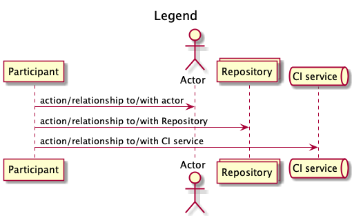

\
\
\
\
\
\
\
\
\
 
# TEST REPORT<!-- omit in toc -->
## Course ID: COMP.SE.200-2021-2022-1 Software Testing
\
\
\
\
\
\
Diyaz Yakubov H298010  
GitHub project: https://github.com/DiyazY/COMP.SE.200-2021-2022-1  
05.12.2021
\
\
\
 

# Table of contents <!-- omit in toc -->

- [Definitions, acronyms and abbreviations](#definitions-acronyms-and-abbreviations)
- [Introduction](#introduction)
- [Test environment](#test-environment)
- [Test Cases](#test-cases)
- [Findings and conclusions](#findings-and-conclusions)
- [References](#references)

# Definitions, acronyms and abbreviations
* QA - Quality Assurance;
* CI - Continuous Integration;
* LCOV - [LTP GCOV extension](https://github.com/linux-test-project/lcov). 

# Introduction
This document aims to report testing results regarding the [test plan v1.0](https://github.com/DiyazY/COMP.SE.200-2021-2022-1/blob/main/docs/TESTPLAN.md). The document contains 5 sections, which are 
- [Definitions, acronyms and abbreviations](#definitions-acronyms-and-abbreviations) - contains all definitions, acronyms and abbreviations.
- [Introduction](#introduction) - introduction to the document
- [Test environment](#test-environment) - describes tools, packages, libraries, etc. of the environment. The section shows updated view of test environment.
- [Test cases](#test-cases) - this part answers to following questions: "What to test?", "How to test?", "How to evaluate?"
- [References](#references) - contains all cites. 

The document reveals the current state of testing on this project, and answers several questions "What have (not) been tested?", "What is the coverage?", "Are there any issues?". This document is primarily for QA engineers (testers), however, it might be observed by anyone from the team.  

# Test environment
The initial test environment has been changed due to changes in the agreement of the Travis CI provider. Nevertheless, the majority of components are the same, except the CI service and additional test coverage library, now they are GitHub Actions[[1](#references)] and (c8 [[2](#references)]) respectively.  
The diagram bellow depicts a new environment, and it also shows the sequence of testing.

.png)  

# Test Cases
Almost all planned tests were implemented, and the coverage was already satisfactory, it was around 80%. However, during the test writing, some of the coverage metrics were not in good condition. Therefore the team decided to add extra tests that cover more functions. Additional tests are listed in the following list of functions:
* clamp
* compact
* filter
* isBuffer
* isDate
* isTypedArray
* slice
* toNumber

One test case was covered by testing another function because it was a dependency, but the coverage was 100% at all levels. Consequently, we just skipped testing of that function (reduce).

# Findings and conclusions
The table bellow shows bugs that were found during the testing.
|ID|Func|Test case|input|expected output|actual output|
|---|---|---|---|---|---|
|1|chunk function|if values are ['a', 'b', 'c', 'd'] and 2, it should return [['a', 'b'],['c', 'd']]|`(['a', 'b', 'c', 'd'],2)`|`[['a', 'b'],['c', 'd']]`|`[[ 'c', 'd' ],]`|
|2|clamp function|if it clamps 10 with -5 and 5, it should return 5|`(10,-5,5)`|`5`|`-5`|
|3|compact function|if value is ['a', 'b', null, 0, undefined, '',NaN], it should return ['a', 'b','c']|`['a', 'b', null, 0, undefined, '',NaN]`|`['a','b']`|`['b','-1':'a']`|
|4|countBy function|if collection has a match return findings|`([{ user: "barney", active: true },{ user: "fred", active: false },{ user: "tutu", active: false }], (value) => value.active))`|`{ true: 1, false: 2 }`|`{ true: 0, false: 1 }`|
|5|drop function|it should return empty array if array param is string 'qwe'|`('qwe')`|`[]`|`['w','e']`|
|6|isBuffer function|if value is a buffer return true|`(new ArrayBuffer(8))`|`true`|`false`|
|7|isEmpty function|if prototype is seeded return false|`(someObj.prototype)`|`true`|`TypeError: Cannot read property 'equal' of undefined`|

The severity of bugs is pretty high because the library might be used in any place of the business logic, hence, it may be a cause of serious malfunctions. We can't guarantee the correctness of its works.     
Despite the good quality (we think it is good because the number of bugs are low) of the library, the team's advice is not to use it in production yet. Moreover, the code-base even not covered fully, and there is a chance to find more issues. Nevertheless, after fixing listed bugs, it is possible to use it in production with a great cautious. It is due to the fact that not all branches and statements are covered (more tests may fix that). Presently, the overall test coverage is 91%, which is a good result. For more information visit [this page](https://coveralls.io/github/DiyazY/COMP.SE.200-2021-2022-1)
<!-- Make reports of any bugs or issues you happen to find (if any).
Estimate on the overall quality of the tested library. Would it pass your tests? 
Is it ready for production?
Estimate on the test coverage. 
Was the library "fully tested"? Is there any need for further tests? -->

# References
<!-- List of any and all references used in the document. -->
  [1] Github Actions website, https://github.com/features/actions;    
  [2] Github project of c8 library, https://github.com/bcoe/c8;  
  
  
